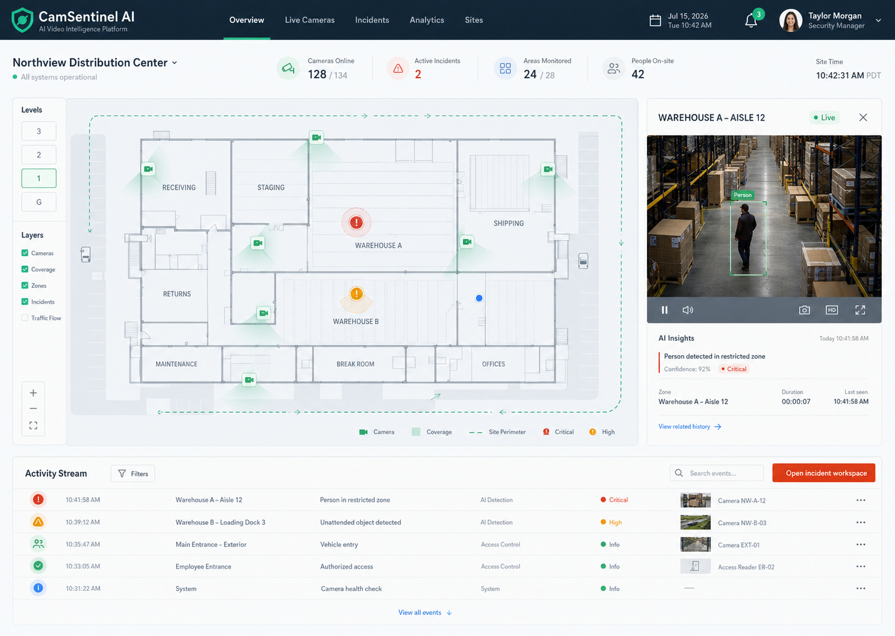

# CamSentinel AI

CamSentinel AI is a frontend-only SaaS demonstration of AI CCTV monitoring software by [XsolAI](https://xsol.ai), created by Ahsan Inam.

It shows how existing security cameras can become a facility intelligence layer for incident review, camera health, operational analytics, onboarding, pricing, and billing workflows. Every camera image and operational record in this repository is synthetic or simulated.



## Product demo

- Marketing landing page and SEO-focused pricing
- Mock login, signup, and password recovery
- Guided site and camera onboarding
- Simulated checkout with no payment transmission
- Spatial facility overview
- Incident review and resolution
- Operational analytics
- Sites, cameras, settings, and billing

## Technical architecture

- Next.js App Router and React
- TypeScript and Tailwind CSS
- Phosphor icon system
- Static marketing metadata and Schema.org structured data
- Deterministic client-side demo state stored in localStorage
- Vitest verification and GitHub Actions CI

No API, database, authentication provider, camera stream, model endpoint, or payment processor is connected.

## Run locally

```bash
npm install
npm run dev
```

Open `http://localhost:3000`.

## Verify

```bash
npm run lint
npm run typecheck
npm test
npm run build
```

## Intellectual property

Copyright © 2026 XsolAI. All rights reserved. Created by Ahsan Inam. See [LICENSE.md](LICENSE.md).
